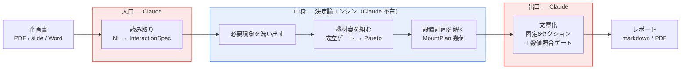
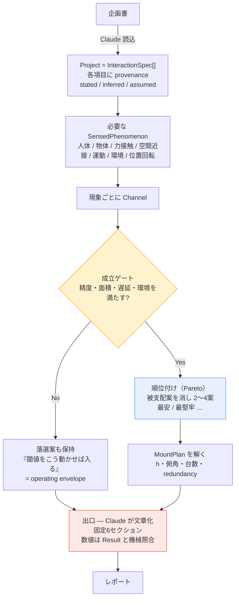
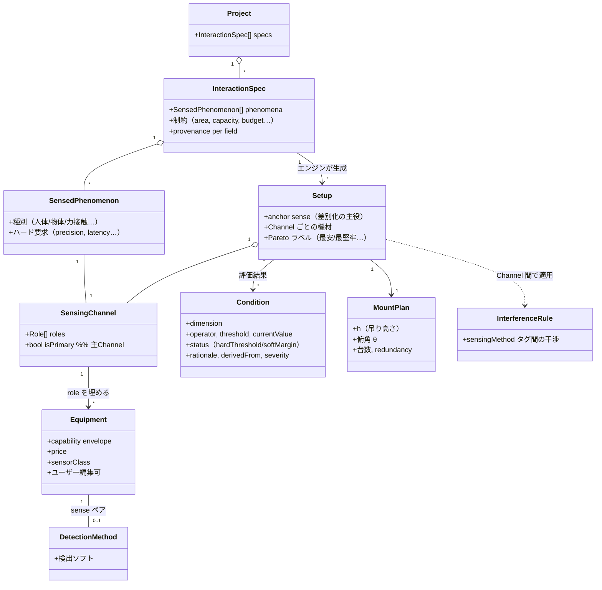
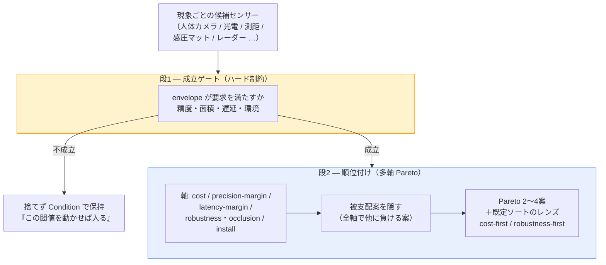
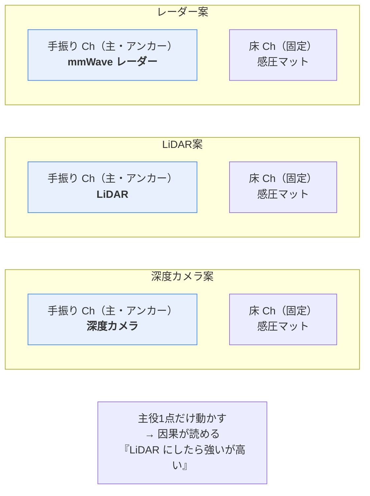
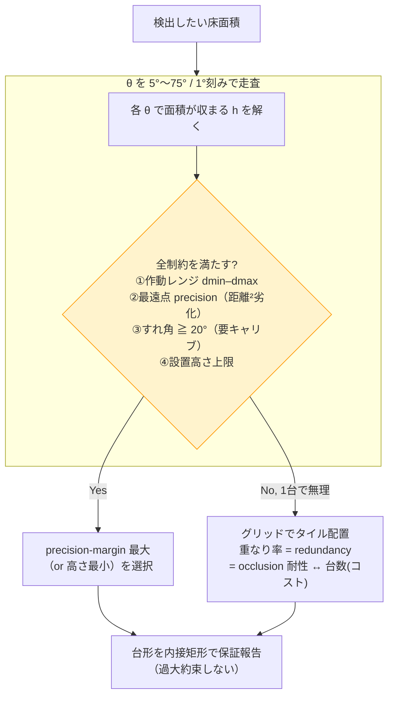
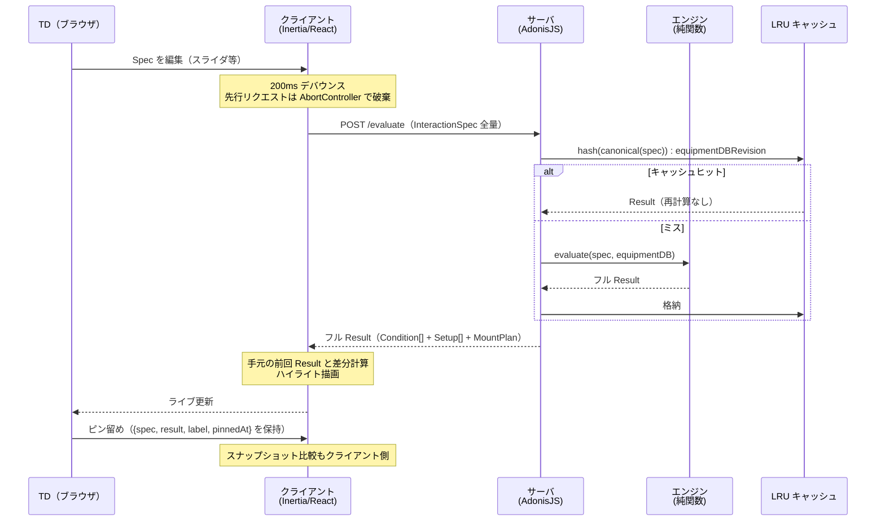
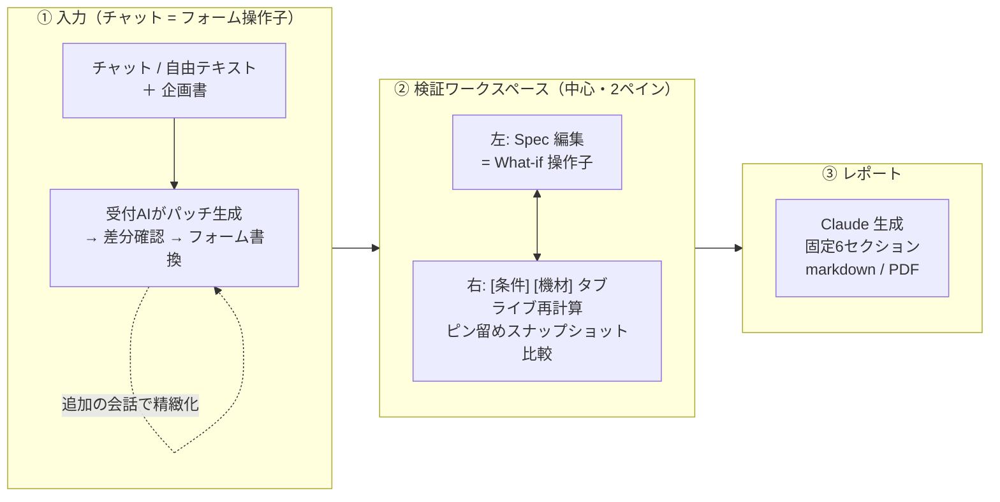
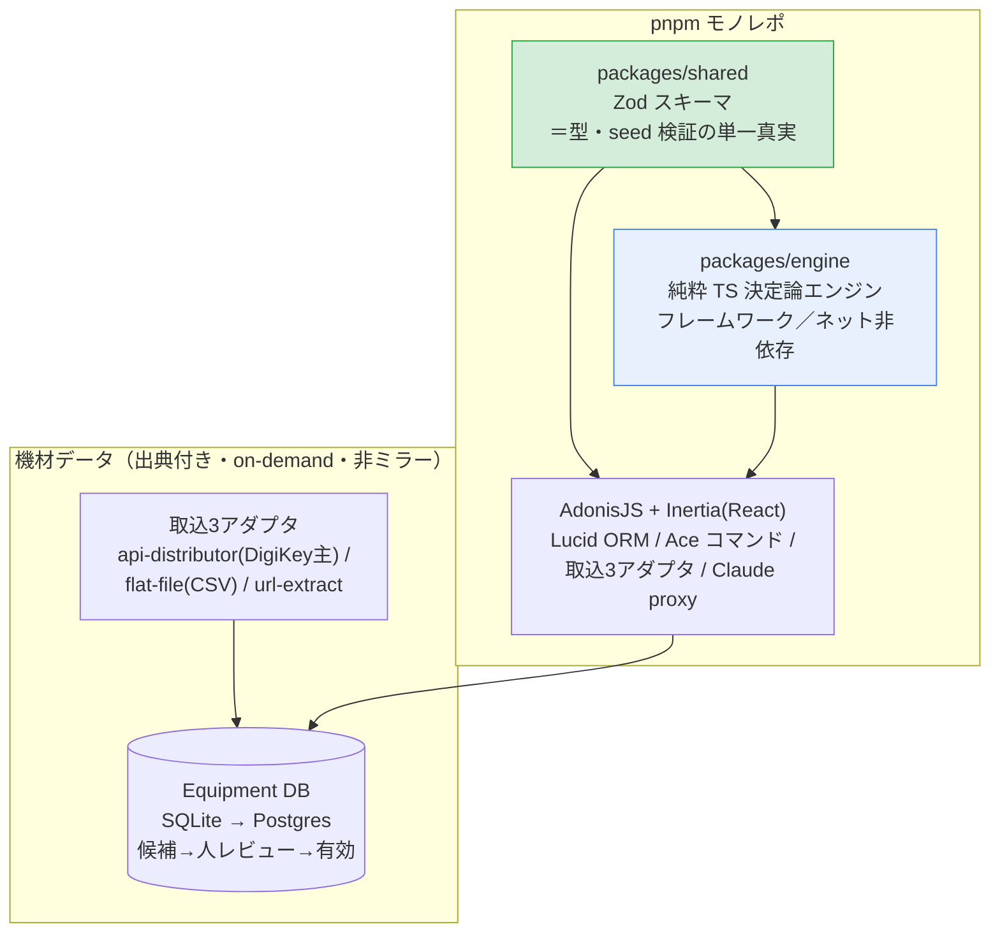

# FeasiSense 設計概観（図解）

> インタラクティブ体験の **実現性検証 ＋ 機材提案** Web アプリ。
> 「成立する／しない」の○×ではなく、**成立条件（operating envelope）＋トレードオフ付き機材案** を返す。
> 詳細な個別判断は `docs/adr/`、用語は `CONTEXT.md` を参照。これはそれらを一望する1枚。

---

## 1. 一番大事な原則 — Claude は両端だけ、計算はエンジン

計算はすべて決定論的ルールエンジンが持つ。Claude は「入口（読み取り）」と「出口（文章化）」のみ。
だから結果は再現可能で、全数字を追跡できる。



---

## 2. データの流れ（エンドツーエンド）



---

## 3. データモデル



---

## 4. 機材案の組み方 — 成立ゲート → Pareto → アンカー

### 2段構え



### アンカー = 案ごとに変える「主役機材」

主 Channel（最もきつい現象）だけ機材を変えて差別化。残りは固定。



---

## 5. 設置計画（MountPlan）の幾何

センサーを高さ h・俯角 θ で吊ると、床に **台形（キーストン）** の検出範囲ができる。
エンジンは「この床面積を検出したい」から逆に (h, θ) と台数を解く。

```
        センサー ●  高さ h、俯角 θ
                /|\
               / | \  縦視野角 αv
              /  |  \
   ──────────────────────── 床
         近端  軸  遠端
          └────┬────┘
        台形の検出範囲（保証は内接矩形）
```



---

## 6. What-if のラウンドトリップ（サーバ権威）

計算はサーバ。クライアントは Spec をいじって往復させ、結果を並べて比較。



> キャッシュキーに `equipmentDBRevision` を混ぜるのが肝。
> 機材DBを編集すると新リビジョンで別キーになり、古い結果を自然に陳腐化させる。

---

## 7. UI フロー

**入力方式（論点E）:** 入口は2系統＝チャット/自由テキスト ＋ 企画書アップロード。どちらも「種」。
**チャットは会話ログに条件を貯めない** ── 1メッセージ → 受付AIが **フォームへのパッチ（差分）** を生成 → フォームを書き換える（適用前に差分確認）。
**唯一の真実は構造化フォーム（InteractionSpec）**。What-if もレポートも全部フォーム相手。AI 書換項目は provenance=inferred/assumed、ユーザー修正で stated。ADR-0001「Claude は入口」の枠内（一発→反復になるだけ）。



---

## 8. 技術スタック



---

## 参照

- 個別判断: `docs/adr/0001`〜`0005`
- 用語集・対話例: `CONTEXT.md`
- データシード: `data/*.seed.json`
