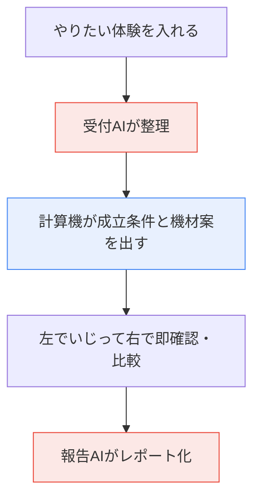

# Sensorium ってなに？ — はじめに読む1枚

やりたい体験を伝えると、それをどんな機材でどこまで実現できるかを返してくれる。Sensorium はそういう相棒です。

床を踏んだら光が灯る、手を振ったら映像が動く。そういうインタラクティブな展示や体験を作ろうとすると、最初に必ず三つの壁にぶつかります。本当に実現できるのか。どんな機材がいくらで要るのか。広い会場で人が増えても壊れないのか。

Sensorium はこの問いに、できるかできないかの二択では答えません。ここまでの条件なら成立する、機材はこの三案でそれぞれ一長一短、という形で返します。

## なぜ必要なのか

これまで、この見極めは経験を積んだ人の頭の中にしかありませんでした。この面積なら深度カメラ二台、ただし人が重なると見えなくなるから配置を工夫して、予算を削るなら感圧マットだが踏んだ位置しか取れない。こうした勘どころを構造として外に出し、誰でも素早く、抜け落ちなく引き出せるようにする。それが狙いです。

候補に挙げるのはカメラだけではありません。光のセンサー、距離を測るセンサー、床に敷く感圧マット、レーダーといった工業用のセンサーまで含めて考えます。人を撮れるかどうかではなく、どんな物理現象なら検出できるかという発想に立つ。ここが他にない強みになります。

## 腕のいいコンサルタントを三人雇うようなもの

Sensorium は三人組のチームだと思ってください。話を聞いて整理する受付係、数字を計算する技師、結果を読みやすい文章にまとめる報告係です。

受付係はAIです。企画書やあなたの話を受け取って、要するに何を検出したい体験なのかを整理します。

技師は計算機です。ここが心臓部で、AIではありません。決まったルールに沿って淡々と数字を出す機械なので、何度やっても同じ答えになり、出した数字の根拠を最後までたどれます。

報告係もAIです。技師が出した数字を、そのまま読めるレポートの文章に仕立てます。ただし数字をでっち上げることはできません。技師の出した値としか突き合わせられない仕組みになっているからです。

肝心なのは、計算をAIにやらせないこと。AIは話を聞く入口と、文章を書く出口にだけ立ちます。真ん中の計算は機械が担う。だから結果を信じられるし、同じ入力なら同じ答えが返ります。

## 使う流れ

最初に、企画書のPDFやスライドを渡すか、チャットにやりたいことを書き込みます。受付係のAIがそれを読み取り、確認用のフォームに整理してくれる。情報が足りないところは、仮にこう置きましたと印をつけたうえで、止めずに先へ進みます。

ここで一つ覚えておいてほしいことがあります。チャットは条件を貯めておく場所ではなく、フォームを書き換えるための操作だということです。十メートル四方の床で踏むと光る、と書けば、面積や検出する現象がフォームの欄に入る。やっぱり夜の屋外で、と足せば、環境の欄がそれに合わせて書き換わる。書いた文章そのものが条件になるのではなく、AIがフォームの該当箇所を直していきます。面積を百から二百二十五平方メートルに変えます、というように差分を見せてから反映するので、知らないうちに数字が動くことはありません。これ以降の調整も、案の比較も、レポートも、すべてこのフォームを相手にします。

なぜチャットに条件を貯めないのか。理由は三つあります。スライダーで面積を一・五倍にするには、面積が数値の欄として存在していないと掴めません。明記したのか、推論なのか、仮に置いただけなのかという印は、欄ごとにしか付けられません。そして会話は書けば書くほど伸びていくので、今どれが有効な条件なのかが曖昧になっていきます。

整理が済んだら、いじって試す画面に移ります。ここが主役です。画面は左右に分かれていて、左で条件をいじると右の結果がその場で変わる。面積を一・五倍にしたらカメラが二台から三台になって予算をはみ出した、というふうに、原因と結果がすぐ目に見えます。気に入った案はピン留めして、横に並べて見比べられます。

最後に、概要、体験の中身、成立する条件、おすすめの機材、設置プラン、リスクの六項目で、報告係のAIが文章をまとめます。markdown でも PDF でも出せるので、クライアントにそのまま渡せます。

## 押さえておきたい三つの考え方

一つめ。できるかできないかではなく、どこまでなら成立するかを返します。できる、できない、とだけ言われても現場では動けません。面積が二十平方メートルまでなら成立し、それを超えるとカメラを足すことになって予算をはみ出す。そういう境界線を示すことに、このアプリのいちばんの値打ちがあります。

二つめ。機材の案は、主役を一つだけ替えて並べます。三案を出すとき、主役の機材だけを変えて、脇役は固定しておく。A案は深度カメラ、B案は LiDAR、C案はレーダー。そのどれもが床側には同じ感圧マットを使う、という具合です。こうしておくと、A案からB案に替えると何が良くなって何が高くつくのかが一目で分かります。全部をいっぺんに変えてしまうと、何が効いて結果が動いたのか追えなくなる。だから一点だけ替えるのです。

三つめ。明らかに劣る案だけを消して、残りは全部見せます。たくさんの候補から一位を選ぶのではありません。安さでも丈夫さでも他のどれにも負けている案、それだけを落とす。残った案は、安さを取るならA、丈夫さを取るならBというふうに、選ぶ人によって正解が変わります。だから勝手に重みをつけて総合一位を決めたりせず、全部残してあなたに選ばせます。

## 全体の流れ

技術的な全体像は [[設計概観（図解）]] に、用語は [[用語集とコンテキスト]] にまとめてあります。
